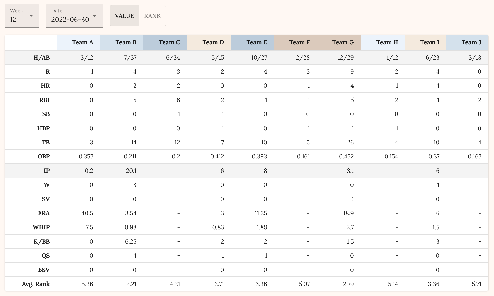
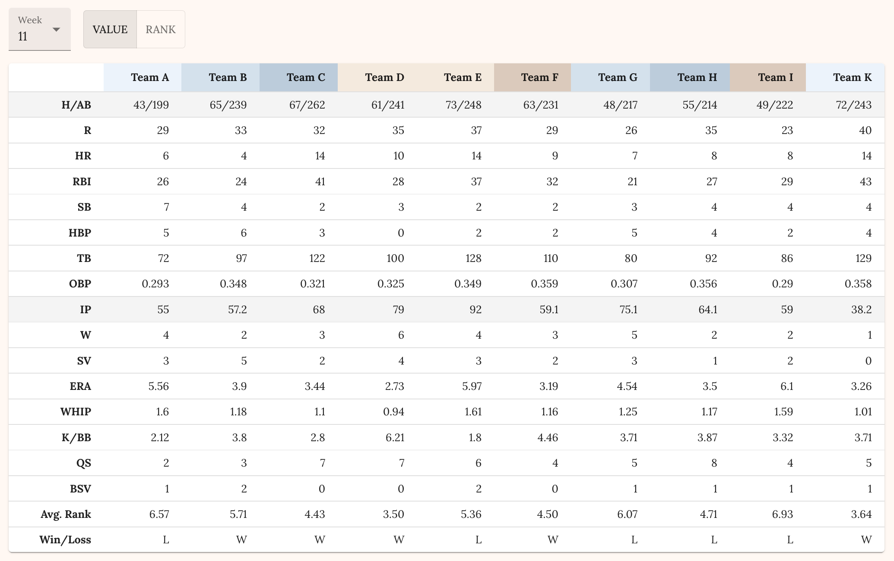
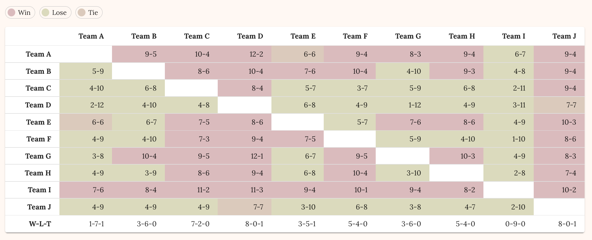
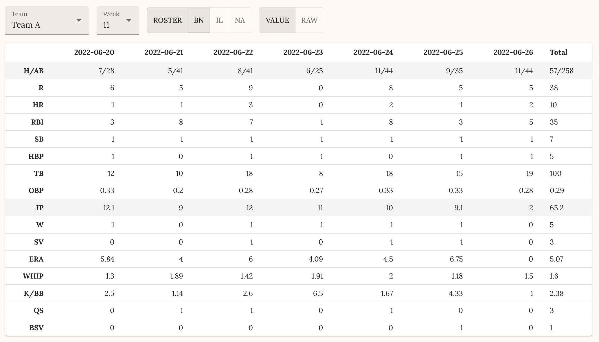
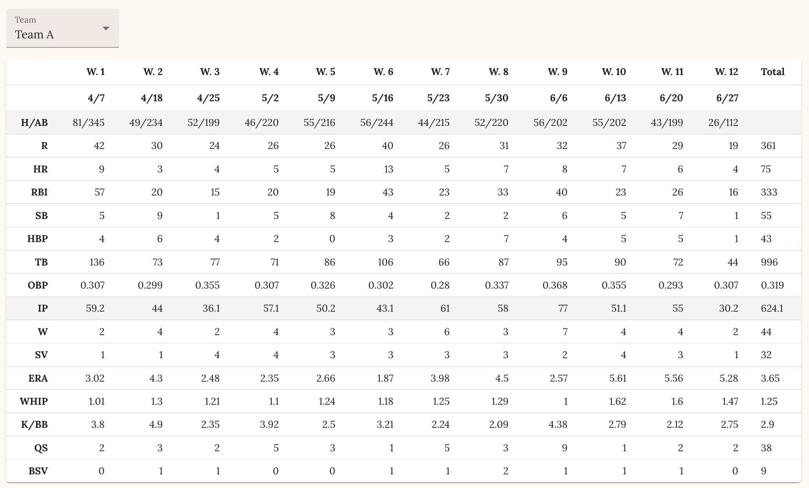

# Fantasy Baseball

A fantasy baseball dashboard for analyzing league and team performance — view daily, weekly, and seasonal stats alongside matchup results.

> The backend is hosted on Render's free tier. Expect a short cold start delay on first load.

**Live site:** [https://dingyiyi0226.github.io/fantasy-baseball](https://dingyiyi0226.github.io/fantasy-baseball)

**Backend repo:** [https://github.com/dingyiyi0226/fantasy-baseball-backend](https://github.com/dingyiyi0226/fantasy-baseball-backend)

## Demo

### League Stats

You can see daily, weekly, and seasonal stats and matchup results

- Daily stats
  

- Weekly stats
  

- Weekly matchup result of all teams
  

### Team stats

You can see team stats and matchup result

- Team stats on selected week (stats on BN, IL, NA are also available)
  

- Team stats in the season
  
